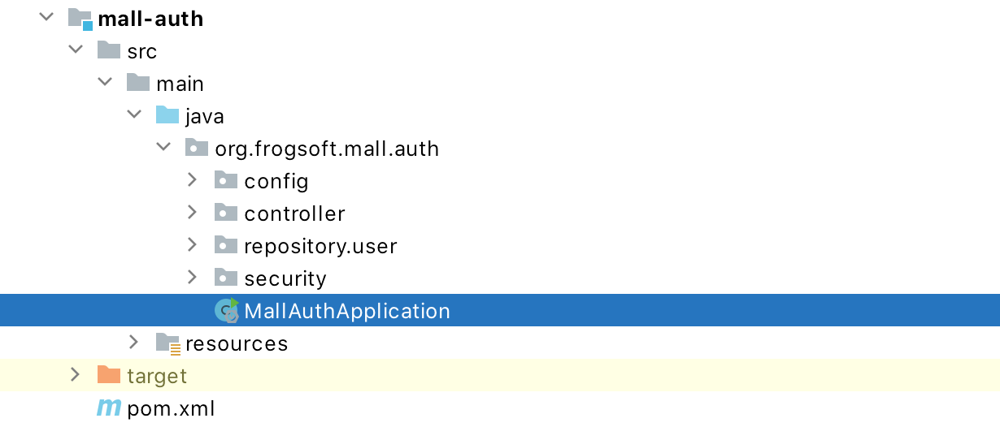
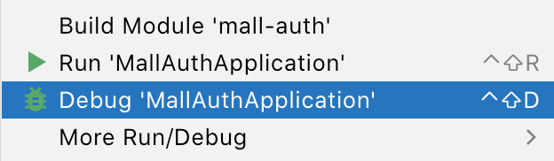
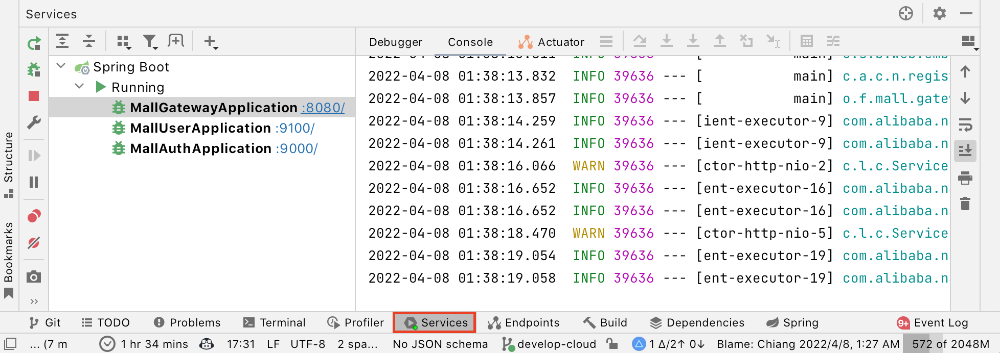
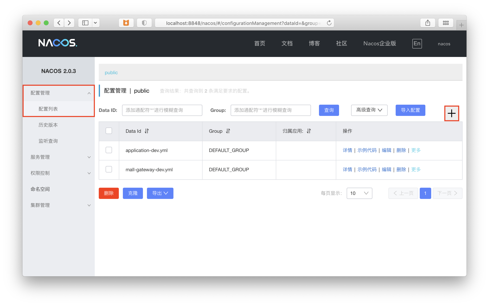
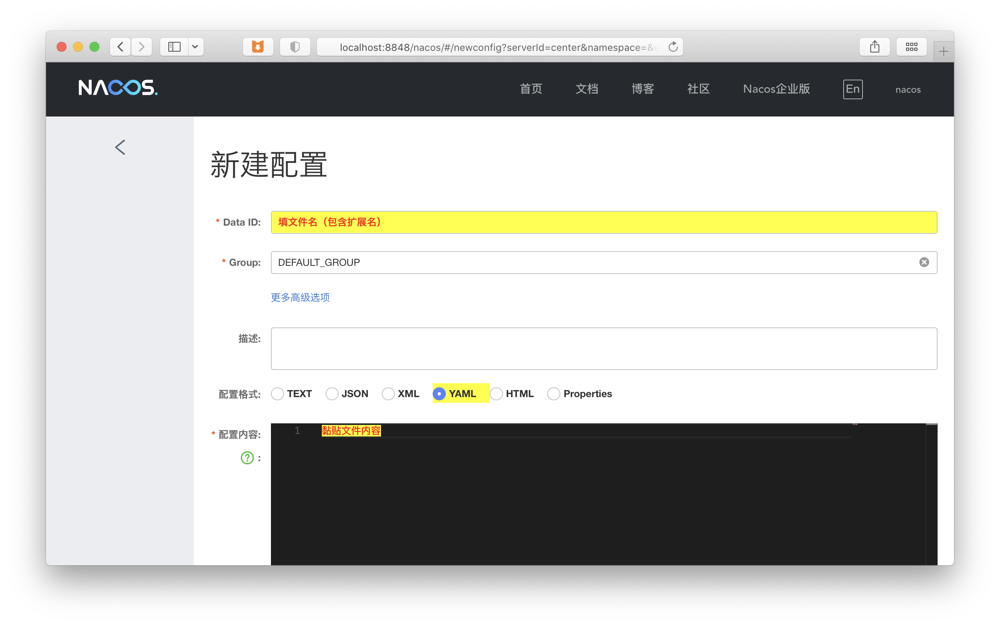

# Quick Start: 如何运行 frogsoft-mall 后端（用户）

> 如果你不需要开发后端代码，例如前端开发者、想测试后端接口的用户等，请参照这一小节运行后端

## 前期准备

你需要有：

- `docker` 以及 `docker-compose` （如果你使用 Windows / macOS ，那么只需要安装 Docker Desktop 便包含了这两个组件）

为确保能够顺畅运行，你也需要有：

- 大约 5 GB 的 ***空闲*** 物理内存
- 大约 10 GB 的剩余磁盘空间（考虑到数据库的内容和其他镜像的大小）

## 运行后端

在 `backend` 目录下，先运行 `docker-compose pull` 拉取镜像，再运行 `docker-compose up -d` 即可启动所有微服务模块及数据库。

> 第一次启动的话，建议再运行 `docker-compose logs -f`  来查看日志。
> 
> 若几分钟后日志输出停止，而且没看到报错退出，那说明启动成功，按 `ctrl+c` 退出日志追踪。

服务网关监听于 `8080` 端口，你可以参照 Apifox 的文档发送请求测试。


# Quick Start: 如何运行 frogsoft-mall 后端（开发者）

> **注意：** 只有当你需要开发后端代码时，才根据这小节运行后端

## 前期准备

你需要有：

- `jdk`（项目基于 JDK 11 ，建议使用 11 及以上）
- `docker` 以及 `docker-compose` （如果你使用 Windows / macOS ，那么只需要安装 Docker Desktop 便包含了这两个组件）

为确保能够顺畅开发，你也需要有：

- 大约 8 GB 的 ***空闲*** 物理内存（包括 IDE 、后端进程等）
- 大约 10 GB 的剩余磁盘空间（考虑到数据库的内容和其他镜像、编译依赖等）

> 尽管你可以不使用 Docker ，但是并不推荐，因为这样的话微服务项目需要运行的一堆东西（例如注册中心、配置中心）还有 openGauss 数据库，就需要你自行安装了。

## 运行后端

要成功运行后端，你需要运行这几类程序：

1. 数据库 * 1 ( `openGauss` )
2. 注册/配置中心 * 1 ( `nacos` + `mysql` )
3. 微服务模块 * n

我们会逐一启动他们。

### 运行数据库

在 `backend` 目录下运行命令 `docker-compose up -d opengauss` 即可启动并初始化数据库。

> 第一次启动的话，建议再运行 `docker-compose logs -f`  来查看日志。
>
> 若几分钟后日志输出停止，而且没看到报错退出，那说明启动成功，按 `ctrl+c` 退出日志追踪。

### 运行注册/配置中心

在 `backend` 目录下运行命令 `docker-compose up -d nacos` 即可启动注册/配置中心。

> 同样，第一次启动的话，建议再运行 `docker-compose logs -f`  来查看日志。
>
> 若几分钟后日志输出停止，而且没看到报错退出，那说明启动成功，按 `ctrl+c` 退出日志追踪。

### 运行微服务模块

上面我们看到了后端的目录结构，其中，这些目录包含了需要运行的模块：

```
├── mall-auth
├── mall-gateway
├── mall-user
```

> 这篇文档旨在 Quick Start ，这里暂时不会描述如何使用命令行启动项目。

如果你使用 Intellij IDEA 那么你需要做的是：

1. 不要新建项目，直接使用 IDEA 打开后端目录 `backend` ，等待索引完成。

2. 启动 ***所有*** 上面列出的需要运行的模块，以下以 `mall-auth` 为例，你需要对要启动的所有模块做这样的操作

3. 选择模块的主类

   

4. 右键选择 Debug 'xxx'，或使用快捷键 `ctrl+shift+D`

   
   
5. 查看日志是否报错。若启动正常，那么你可以继续启动下一个模块了，直到所有模块均启动成功。

到这里后端的开发环境就启动完成了。

现在你能在 Service Tab 中看到这个项目中的模块（第一次打开是没有的），下次你可以从这里快速启动。

   

服务网关监听于 `8080` 端口。


## 有关 NACOS： 如何修改/新建配置

> 一般来说不需要修改配置

然后在你的浏览器中打开 http://localhost:8848/nacos/ 并登录（用户名和密码均为 `nacos`），看到 `配置管理 - 配置列表`。

在新启动的实例上你应该也会看到我内置的几个配置文件，这足够启动微服务模块了，所以理论上是不需要做任何事情的。

如果你要新建/修改配置的话，看一下下面的内容。

现在看后端目录下的 `nacos/config`  你会发现里面有***几***个文件，例如 `application-dev.yml` 。虽然他们只是 NACOS 里面配置文件的备份，但这里面的文件和 NACOS 里面的配置是一一对应的，如果你修改或者新增了配置，记得更新一下这里面的文件。

例如新增配置：

1. 在 `配置管理 - 配置列表` 标签上，点击加号➕添加配置。

   

2. 字段跟 `nacos/config` 下的配置文件备份是这样对应的

   

3. 填写完成后点击右下角的 `发布` 按钮，该配置文件发布结束。

## 环境变量说明

| 变量名称    | 说明                 | 默认值      |
| ----------- | -------------------- | ----------- |
| `NACOS_URL` | NACOS Server 所在 IP | `127.0.0.1` |
| `NACOS_PORT` | NACOS Server 所在端口 | ` 8848` |
